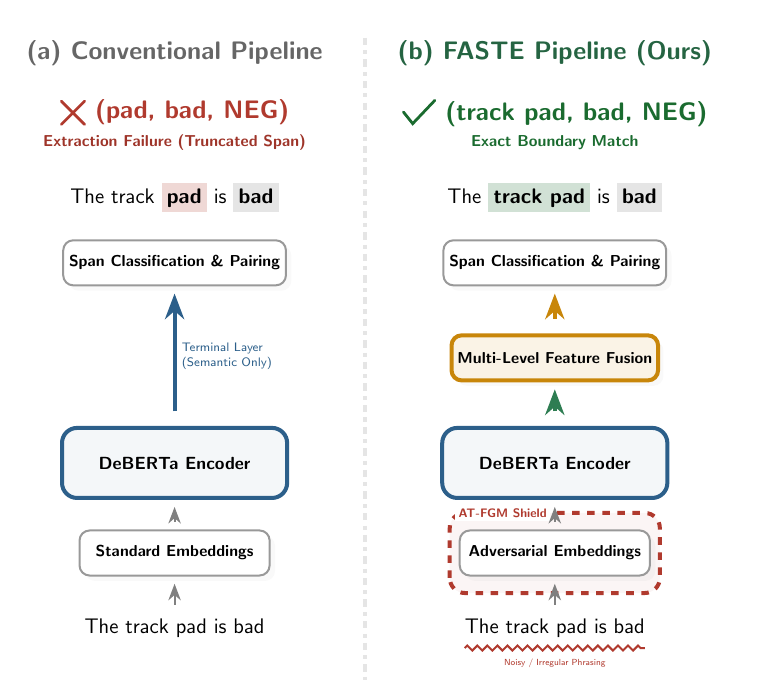
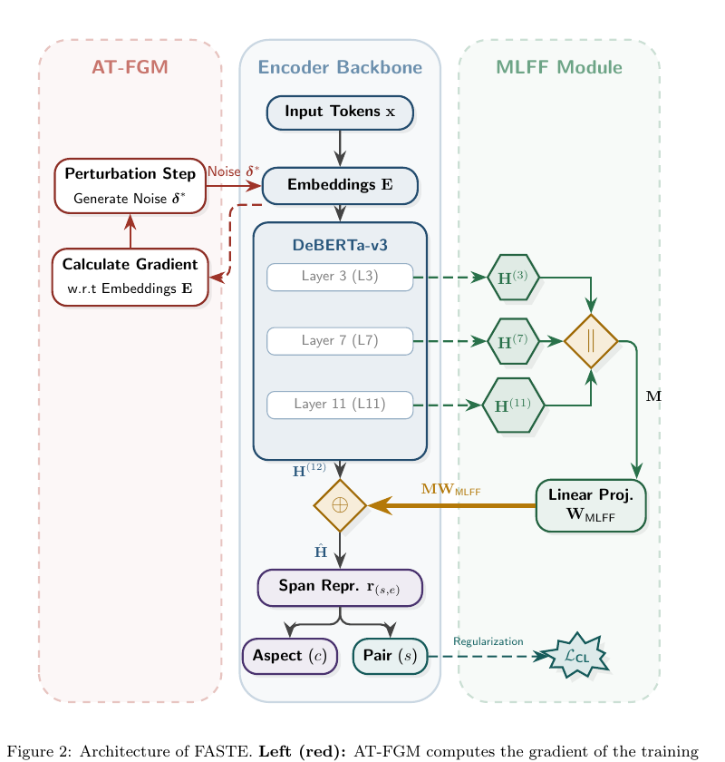
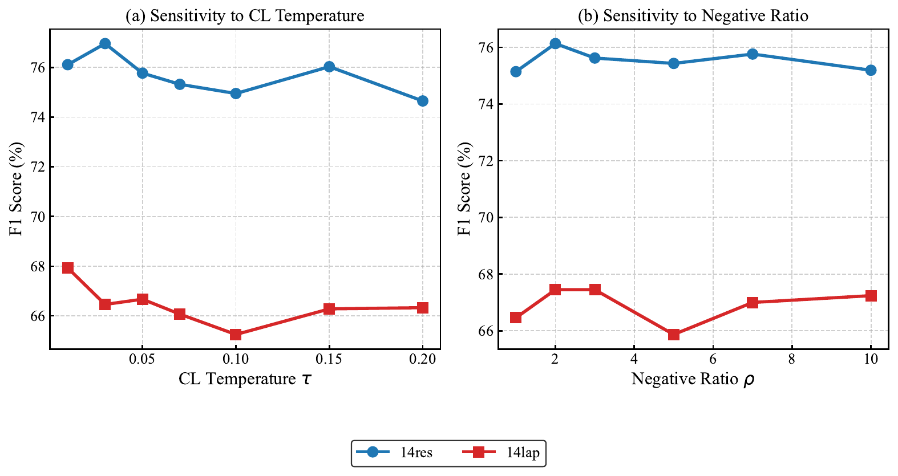
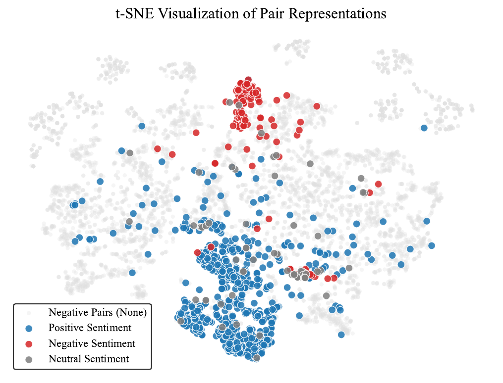

# FASTE：多层特征融合与对抗训练的方面级情感三元组抽取框架

FASTE 是一套面向方面级情感三元组抽取（Aspect Sentiment Triplet Extraction, ASTE）的 span-based 结构化 NLP 框架，当前按 **Expert Systems with Applications（ESWA）** 投稿版本整理。

ASTE 不只是判断一句话的情感正负，而是要同时抽取：

```text
Aspect Term + Opinion Term + Sentiment Polarity
```

例如输入 `The track pad is bad`，模型需要输出 `(track pad, bad, negative)`。这要求模型同时完成边界识别、实体配对、情感极性判断和严格 exact-match 评测，难度明显高于普通分类任务。



## 项目价值

FASTE 的核心目标是做一个适合实时业务系统的结构化情感抽取引擎：保留判别式 span 模型输出稳定、可控、低延迟的优势，同时通过 **MLFF 多层特征融合** 恢复边界线索，通过 **AT-FGM 对抗训练** 稳定噪声文本上的优化过程。

论文版本中的关键结果：

| 项目 | 结果 |
| --- | --- |
| 任务 | Aspect Sentiment Triplet Extraction |
| Backbone | DeBERTa-v3-base |
| 参数规模 | 约 186.3M |
| 吞吐 | 约 400 sentences/s |
| 14lap F1 | **66.60 ± 1.88** |
| 相比 T-T on 14lap | **+2.93 F1** |
| 相比 PASTEL on 14lap | **+1.38 F1** |

## 为什么 FASTE 有意义

现有 ASTE 方法通常有两类不足：

| 方法类型 | 优点 | 问题 |
| --- | --- | --- |
| 生成式 / LLM 方法 | 表达能力强，prompt 灵活 | 输出边界不可控，容易格式漂移，推理成本高 |
| 传统 span 方法 | 输出结构稳定，评测可复现 | 过度依赖最后一层 encoder，容易截断多词 aspect/opinion 边界 |

FASTE 的设计判断是：ASTE 是一个严格结构化抽取任务，工业场景更看重 exact boundary、稳定吞吐和可复现，而不是开放式生成能力。因此它采用 span-based 解码，但增强 encoder 表示和训练鲁棒性。

## 方法架构



### MLFF：Multi-Level Feature Fusion

代码中使用 `MLFF_LAYERS = [3, 7, 11]`，从 DeBERTa-v3 的低层、中层、高层抽取 hidden states：

| 层级 | 捕获信息 |
| --- | --- |
| Layer 3 | 词法、位置、局部边界 |
| Layer 7 | 短语组合、局部句法 |
| Layer 11 | 高层语义、全局上下文 |

这些表示被 concat 后投影回 hidden size，并通过 residual connection 加到最后一层表示上。这样既保留高层语义，又把浅层边界信息重新注入 span 表示。

### AT-FGM：Adversarial Training via Fast Gradient Method

MLFF 注入更多低层特征后，模型在噪声文本上可能出现更崎岖的 loss landscape，训练方差增大。AT-FGM 在 embedding 空间做一次规范化扰动，再进行第二次 forward/backward，用很小的训练期成本平滑局部优化空间。

这个模块不增加推理参数，也不增加推理延迟。它的作用不是单纯“增强鲁棒性”，而是和 MLFF 形成协同：MLFF 带来边界信息，AT-FGM 抑制低层噪声引入后的训练不稳定。

## 主实验结果

下表为 ASTE-Data-V2 四个领域上的结果，FASTE 为 5-seed average。

| 方法 | 14res F1 | 14lap F1 | 15res F1 | 16res F1 |
| --- | --- | --- | --- | --- |
| Span-ASTE | 71.85 | 59.38 | 63.27 | 70.26 |
| SBC | 73.92 | 62.71 | 63.96 | 73.25 |
| SimSTAR | 73.86 | 62.07 | 65.09 | 73.06 |
| ASTE-Trans | 75.27 | 62.83 | 67.89 | 74.61 |
| D2E2S | 75.13 | 63.65 | 65.86 | 74.74 |
| T-T | **75.79** | 63.67 | 68.61 | 74.84 |
| **FASTE** | 75.17 ± 0.41 | **66.60 ± 1.88** | **69.04 ± 0.52** | **76.03 ± 0.94** |

关键解读：

| 数据集 | 现象 | 解释 |
| --- | --- | --- |
| 14lap | FASTE 比 T-T 高 **+2.93 F1** | laptop 领域技术词多、边界不规则，多层边界特征更有优势 |
| 15res | FASTE 比 T-T 高 **+0.43 F1** | MLFF 帮助恢复被最后层弱化的多词候选 |
| 16res | FASTE 比 T-T 高 **+1.19 F1** | recall 提升明显，说明候选覆盖更充分 |
| 14res | FASTE 比 T-T 低 0.62 | restaurant split 句式较规则，密集 pairwise attention 更占优 |

## 与 LLM 系统对比

| 方法 | Backbone | 14res | 14lap | 15res | 16res |
| --- | --- | --- | --- | --- | --- |
| DASTER | DeepSeek-R1 | 76.29 | 63.46 | 67.01 | 76.40 |
| PASTEL | LLaMA-3.2 + GPT-4o | **80.87** | 65.22 | **71.86** | **79.12** |
| **FASTE** | DeBERTa-v3 | 75.17 | **66.60** | 69.04 | 76.03 |

FASTE 在 14lap 上超过 PASTEL **+1.38 F1**。这个结果说明，在专业术语密集、边界要求严格的领域，判别式 span 模型仍然具备实际价值：它不会产生生成式格式漂移，也不需要 GPT-4o judge 这类额外评估链路，更适合需要稳定输出的高吞吐系统。

## 消融实验

消融实验使用固定 3-seed subset，用于隔离结构影响。

| Variant | 14res | 14lap | 15res | 16res |
| --- | --- | --- | --- | --- |
| Baseline | 74.00 ± 0.54 | 65.60 ± 0.80 | 65.03 ± 0.27 | 73.16 ± 1.63 |
| +MLFF only | 74.43 ± 0.64 | 64.87 ± 3.41 | 65.15 ± 4.46 | **76.16 ± 0.83** |
| +AT only | 74.62 ± 0.58 | 66.10 ± 0.75 | 66.61 ± 0.89 | 74.75 ± 2.24 |
| Full FASTE | **75.13 ± 0.78** | **67.15 ± 1.00** | **68.69 ± 0.65** | 75.93 ± 1.64 |

这张表是 FASTE 最有说服力的地方：MLFF 单独使用时，在 14lap / 15res 上方差明显放大；AT-FGM 加入后，Full FASTE 不仅提升均值，也把噪声数据上的方差压回可控范围。这说明两个模块不是简单堆叠，而是有明确协同关系。

## 敏感性与表征可视化





仓库包含敏感性分析和 t-SNE 可视化，用来解释不同超参数和表示空间对抽取效果的影响。t-SNE 主要用于观察 aspect/opinion span 表示是否更容易形成清晰边界，敏感性分析用于排查模型是否依赖极窄的参数设置。

## 工程实现

| 模块 | 说明 |
| --- | --- |
| `SpanInstance` | 统一句子、span、triplet 和 label 的样本结构 |
| `BatchLoader` | 构造候选 span、pair label、mask 和 batch tensor |
| `SpanRepresentation` | 将 token 表示聚合成候选 span 表示 |
| `SpanASTEModel` | DeBERTa-v3 + MLFF + span head + pair head |
| `AdversarialFGM` | 训练期 embedding 扰动与恢复 |
| `evaluate` | 严格 exact-match P/R/F1 |
| `run_main` | 主实验 |
| `run_ablation` | 组件消融 |
| `run_sensitivity` | 温度、负采样比例等敏感性 |

## 仓库结构

```text
.
├── aste.py                    # 主训练、预测、评测、消融、敏感性
├── add_ablation.py            # MLFF layer selection ablation
├── extract_tsne.py            # 表征可视化数据抽取
├── create_image.py            # 论文图表生成
├── paper_results.zip          # 实验日志与结果包
├── sensitivity_analysis.pdf   # 原始敏感性分析图
├── tsne_visualization.pdf     # 原始 t-SNE 图
└── docs/assets/               # README 可预览图
```

## 运行方式

```bash
python aste.py --mode main --datasets lap14 res14
```

运行消融或敏感性分析：

```bash
python aste.py --mode ablation --datasets lap14
python aste.py --mode sensitivity --datasets lap14
```

实际数据路径由 `aste.py` 中的 `DATA_ROOT` 和 `DATASET_CONFIGS` 控制。

## 项目状态

- 论文状态：ESWA 投稿版本；
- 代码状态：主实验、消融、敏感性、t-SNE、结果包和 README 图表已整理；
- 许可协议：MIT License。
